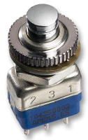

## Introduction

The Astro Pi Flight Unit is one of the most sought-after cases in the history of the Raspberry Pi. The original Mark I hardware Flight Units have been in operation on the ISS since 2015. In 2021, new, upgraded Astro Pis are being sent as replacements. With inclusion of new sensors and the Raspberry Pi High Quality Camera, a new Flight Unit design was required. 

In this resource, you will learn how to 3D print your own Astro Pi Mark II Flight Unit case and install the Astro Pi hardware inside it. You’ll then have your very own Astro Pi flight unit, identical in almost every way to the new ones which will soon be operational on the International Space Station right.

### What you will make

--- no-print ---
Here is an example of how your finished 3D-printed Astro Pi flight case might look:

  <iframe allowtransparency="true" width="485" height="402" src="https://scratch.mit.edu/projects/embed/160619869/?autostart=false" frameborder="0"></iframe>

--- /no-print ---

--- print-only ---

--- /print-only ---

--- collapse ---
---
title: What you will need
---
### Hardware

+ Raspberry Pi 4 and SD card
+ Raspberry Pi High Quality Camera 
+ Sense HAT
+ 2 push buttons
+ 4 Jumper wires, one end needs to be male.
+ Kemet PIR
+ fastenings
+ fastenings
+ fastenings

If you want to buy the exact buttons used in the Astro Pi flight unit, the details are below. At a price of £10 each, they are expensive — that's because they're designed to survive an enormous number of clicks before wearing out, a feature which is necessary for a five-year space mission.

- Manufacturer: APEM
- Manufacturer Part No: 104350003

### Additional requirements

+ Access to a 3D printer. Many schools now have their own, but if your school doesn’t, you might be able to find one at your local [hackspace](http://www.hackspace.org.uk/){:target="_blank"}. You can also find local 3D printing services through the [3D Hubs website](https://www.3dhubs.com/){:target="_blank"}.

You’re also going to need the following tools:

+ XX allen key
+ XX allen key
+ Small pair of pliers
+ Craft knife or scalpel
+ Sandpaper
+ Tape
+ Wire strippers
+ Wire cutters
+ Soldering iron and solder

### Software

+ Raspberry Pi OS

### Downloads

+ Download the project [starter file](http://rpf.io/p/en/projectName-go){:target="_blank"} if working offline

--- /collapse ---

--- collapse ---
---
title: What you will learn
---

+ Learning objective 1
+ Learning objective 2
+ Learning objective 3

--- /collapse ---

--- collapse ---
---
title: Additional information for educators
---

You can download the completed project [here](http://rpf.io/p/en/projectName-get){:target="_blank"}.

If you need to print this project, please use the [printer-friendly version](https://projects.raspberrypi.org/en/projects/projectName/print){:target="_blank"}.

--- /collapse ---
