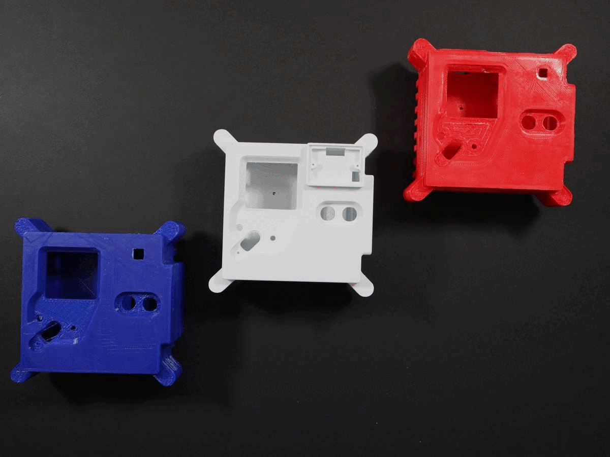

## Introduction

The Astro Pi Flight Case is one of the most sought-after cases in the history of the Raspberry Pi. The original Mark I hardware Flight Units have been in operation on the International Space Station (ISS) since 2015. In 2021, new, upgraded Astro Pis were sent as replacements. With the inclusion of a more powerful Raspberry Pi, new sensors, and the Raspberry Pi High-Quality Camera, a new Flight Case design was required. 

In this resource, you will learn how to 3D print your own Astro Pi Mark II Flight Case and install the Astro Pi hardware inside it. You’ll then have your very own Astro Pi Flight Unit, identical in almost every way to the new ones that are now operational on the ISS.

You don't have to follow every step exactly as it is described in this guide, which is intended to provide a reliable set of instructions for someone who would like to produce a replica case. There are often many different ways to tackle projects like this, so if you have another preferred technique, or think that something should be done in a different way, you should go ahead and try an alternative approach. This is particularly true for the 3D printing part of the project: there are lots of different 3D printers and filaments and you should expect to have to modify some of the steps in order to take these differences into account. Please note that this is a complex project and that you should expect to have to tweak your process for best results. Be prepared for print jobs that don’t produce the best possible parts first time. 

### What you will make

--- no-print ---
Here are some examples of how your finished 3D-printed Astro Pi Flight Cases might look:

--- /no-print ---

--- print-only ---

--- /print-only ---

--- collapse ---
---
title: What you will need
---
### Hardware

+ [Raspberry Pi 4](https://www.raspberrypi.com/products/raspberry-pi-4-model-b/) and SD card
+ [Raspberry Pi High-Quality Camera](https://www.raspberrypi.com/products/raspberry-pi-high-quality-camera/) 
+ [Raspberry Pi Sense HAT](https://www.raspberrypi.com/products/sense-hat/)
+ 2 Push buttons (either 10mm diameter thread or 7mm — see below)
+ [Kemet](https://uk.farnell.com/kemet/ss-430l-w/pir-sensor-5m-37deg-28deg-5-5vdc/dp/3027688) or [Parallax](https://www.parallax.com/product/pir-sensor-with-led-signal/) PIR sensor (as supplied in the official Mission Space Lab kits)
+ If using the Kemet PIR sensor, you'll also need the [right cable](https://www.digikey.co.uk/en/products/detail/jst-sales-america-inc/A05SR05SR30K152B/6708507)
+ If using the Parallax PIR sensor, you'll need a three-segment electrical connector block
+ M2.5/M2.5 × 11mm × 5mm M/F threaded hexagon spacers – nickel plated brass
+ M2.5/M2.5 × 10mm × 5mm M/F threaded hexagon spacers – nickel plated brass
+ [26-Pin tall header](https://thepihut.com/products/stacking-header-for-raspberry-pi-2x13-extra-tall)
+ M2.5 × 6mm full thread cap head screws (DIN 912) – A2 stainless steel
+ M4 × 12mm full thread cap head screws (DIN 912) – A2 stainless steel
+ M2 × 8mm full thread cap head screws (DIN 912) – A4 stainless steel
+ 7 Short (approx. 120mm) jumper wires, with one end F
+ Some 2mm diameter heat shrink tubing
+ A 90 × 50mm strip of [Rosco 98 medium grey filter film](https://us.rosco.com/en/products/filters/r98-medium-grey) 

If you want to buy the [exact buttons](https://www.mouser.co.uk/datasheet/2/26/pusbutton-switches-serie-10400-1519227.pdf) used in the Astro Pi Flight Unit, the details are below. However, they are expensive — that's because they're designed to survive an enormous number of clicks before wearing out, a feature that is necessary for a five-year space mission.

- Manufacturer: APEM
- Manufacturer Part No: 104350003

If you want to use different (cheaper) buttons, then go ahead. We have two different versions of the top panel of the flight unit, one for 10mm buttons, one for 7mm. You should decide on your choice of buttons before printing your case!

### Additional requirements

+ Access to a 3D printer. Many schools now have their own, or you might be able to find one at your local [Makerspace](http://www.hackspace.org.uk/){:target="_blank"}. You can also find local 3D printing services through the [3D Hubs website](https://www.3dhubs.com/){:target="_blank"}.

You’re also going to need the following tools:

+ 1.5mm Allen key
+ XX Allen key
+ Small pair of pliers
+ Craft knife or scalpel
+ Sandpaper
+ Scissors
+ Sticky tape
+ Wire strippers
+ Wire cutters
+ Soldering iron and solder (if you've never soldered before, have a look at [this video](https://www.raspberrypi.com/news/getting-started-soldering/) for some tips) 
+ Hot air gun

### Software

+ Raspberry Pi OS

### Downloads

+ [Self test software](resources/selftest.zip)

--- /collapse ---

--- collapse ---
---
title: What you will learn
---

+ Techniques to 3D print irregular shapes
+ How to connect electronics to the Raspberry Pi computer using GPIO pins

--- /collapse ---

--- collapse ---
---
title: Additional information for educators
---

If you need to print this project, please use the [printer-friendly version](https://projects.raspberrypi.org/en/projects/projectName/print){:target="_blank"}.

--- /collapse ---
