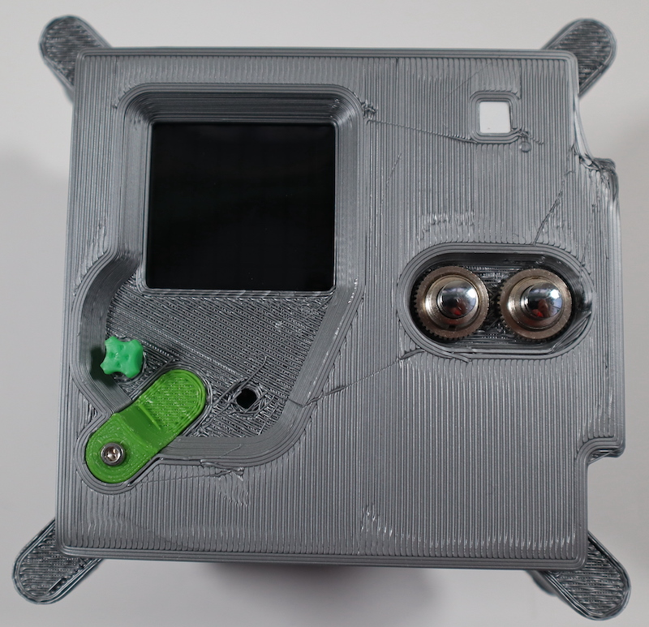

## Assemble the case

Once you're happy that the internals of the case are complete, you can proceed to the final assembly stage.

--- task ---

Cut a strip if the grey filter material 45 x 90 mm and fold it in half. Use two small pieces of tape to attach it to the inside of the top panel, over the LED matrix window.

--- /task ---

--- task ---

Take the top panel and gently tuck the wires into the space on the right of the Pi as neatly as you can.

--- /task ---

--- task ---

Place the top panel on top of the bottom case part.

--- /task ---

--- task ---

Screw the two case halves together with the M4 x 12mm screws.

--- /task ---

--- task ---

Install your 3D-printed joystick cap by pressing it onto the Sense HAT joystick. You will probably need to use glue to keep it in place, but only apply the glue once you've tested everything and are happy that it all works. The Astro Pis on the ISS use a 3D printed cap too!

--- /task ---

--- task ---

Fit the four legs into the holes on the rear panel. You may need to use glue to keep them in place, or you can try adjusting the dimensions of the part to optimise the fit for parts printed on your specific printer. 

--- /task ---

Your Astro Pi is almost complete — the last thing to do is to add the colour sensor window. Fit this into the slot and attach with a M2.5 x 6mm screw.

