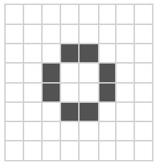

## Test the hardware

--- task ---

Once you have assembled the Astro Pi, start it up with a monitor, keyboard, and mouse connected.

--- /task ---

For use on the ISS, we created a program that performs a test of the hardware to make sure everything is working. You download a version of this software to run on your 3D printed Astro Pi to check your wiring.

--- task ---
Download the software and then open a terminal window and enter these commands:

```bash
unzip selftest.zip
```

--- /task ---

--- task ---
Then run the tests:

```bash
cd selftest
python3 selftest.py --timeout 20
```
A series of tests will begin, some run autonomously whereas others are interactive and require a user to physically manipulate the Astro Pi unit when prompted. If you want longer to complete each test, increase the value supplied as the `timeout1` parameter.

Initially, some of the LEDs on the matrix light up, indicating the outcomes of the diagnostic tests. Then a series of icons will be displayed to indicate which interactive test is active.

First will be the humidity sensor test. 



When you see this icon in red, blow on the hole to the right of the light sensor window. If the sensor is working (and you've provided sufficiently moist puff), the icon should turn green.

Next is the gyroscope test. 


When you see this icon in red, tilt the Astro Pi Flight Unit towards any of the four directions, in any order, until  all four squares that make up the icon have turned green.

Then there is the accelerometer test. 


When you see this icon in red, shake the Astro Pi Flight Unit until the icon has turned green.

Next up is the motion sensor test. 


When you see this icon in red, wave your hand in front of the Astro Pi Flight Unit until the icon has turned green.

The penultimate test is for the joystick. 


When you see this icon in red, move the joystick in any of the four directions, in any order. Then press the joystick (like a button). All elements of the icon should turn green.

The final test is for the two buttons. 


When you see this icon in red, press buttons A and B, in any order. Both squares of the icon should turn green.
--- /task ---

If any of the test fail, look at whatever messages are displayed in the Terminal for clues as to what may have gone wrong.  If the motion sensor or buttons test fails, check that you have connected the jumper wires to the correct GPIO pins as described earlier.