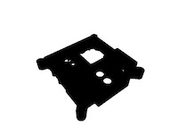

## Get the 3D files

The 3D files are in [STL](https://en.wikipedia.org/wiki/STL_%28file_format%29){:target="_blank"} format, which is widely used in 3D printing all over the world. If you import them using metric millimetres (mm), no scale adjustments will be required.

If you want to reproduce an authentic copy of the Astro Pi Flight Cases, you'll want to use one of the Kemet PIR sensors that is included on the ISS devices.

However, if you're wanting to build a Flight Case for your Astro Pi Mission Space Lab kit, then you may wish to use the modified STL files that have been produced to allow you to easily fit the Parallax PIR sensor (which is supplied in the kit) to the front panel. 

This means that there are four different options for the front panel: each sensor option has two possible button sizes. Make sure you download and print the right one for your project.

Please note that these STL files are licensed under a [Creative Commons Attribution-NonCommercial-ShareAlike 4.0 International License](http://creativecommons.org/licenses/by-sa/4.0/).

--- task ---

Download each of these files and save them to a folder on your computer:

--- /task ---

**Part 1: Flight Unit front panel**

Here is the standard case front panel, like the ones on the ISS. It has a square hole in the top-right corner **for the Kemet PIR sensor**.

Version 1:  10mm button holes, for use with the buttons used on the ISS Flight Units

[Astro_Pi_Mark_II_upper_kemet_1](resources/Astro_Pi_Mark_II_upper_kemet_1.STL) 

Version 2:  7mm button holes

[Astro_Pi_Mark_II_upper_kemet_small_buttons_1](resources/Astro_Pi_Mark_II_upper_kemet_small_buttons_1.STL) 
  
Here are the modified versions; these have a slot for mounting the larger **Parallax PIR sensor** that is supplied in the official Astro Pi Mission Space Lab entrant kits.

Version 3:  10mm button holes, for use with the buttons used on the ISS Flight Units

[Astro_Pi_Mark_II_upper_parallax_1](resources/Astro_Pi_Mark_II_upper_parallax_1.STL) 

Version 4:  7mm button holes

[Astro_Pi_Mark_II_upper_parallax_small_buttons_1](resources/Astro_Pi_Mark_II_upper_parallax_small_buttons_1.STL) 
  
**Part 2: Flight Unit base**

[Astro_PI_Mark_II_lower_1](https://github.com/raspberrypilearning/astro-pi-flight-case/raw/master/data/3d-printed/STL/Astro_Pi_Base_Pi1_or_2.stl) 

**Part 3: High-Quality Camera sensor mount**

[Astro_Pi_Mark_II_camera_1](resources/Astro_PI_Mark_II_lower_1.STL) 

**Part 4: Light sensor window**

The windows on the ISS Flight Units are printed using a transparent resin. This may be difficult to reproduce without a more specialised printer. If you're building a Flight Unit to use with an Astro Pi Mission Space Lab entry kit, we suggest you omit the window so that you can get useful data from the Sense HAT's light sensor. 

If you don't need to use the light sensor, or have an older Sense HAT that doesn't have a light sensor, you could print the window using the same colour filament as the rest of the case, or maybe use a different colour for a custom look. 

[Astro_Pi_Mark_II_window_1](resources/Astro_Pi_Mark_II_window_1.STL) 

**Part 5: Joystick cap**

[Astro_Pi_Mark_II_joystick_cap_1](resources/Astro_Pi_Mark_II_joystick_cap.stl)

Note that this joystick cap may need some slight adjustments due to the nozzle size and layer height of your printer. If you have difficulty with fitting it onto the stump of the Sense HAT joystick, then try using a layer height of 0.1mm as opposed to 0.15mm. Because the part is so small, it is also prone to heat warping. The cap was designed using [Tinkercad and you can remix the design](https://www.tinkercad.com/things/9LQoVurYOeM) to precisely adjust the dimensions so that the cap produced by your printer correctly fits the Sense HAT's joystick rod.

**Part 6: Legs**

To protect the lens and any window surface against which the Astro Pi may be placed onboard the ISS, the Flight Unit has four removable titanium legs with plastic balls on the end. 

[Astro_Pi_Mark_II_leg](resources/Astro_Pi_Mark_II_leg.stl)

This part is also available for [tweaking and remixing on Tinkercad](https://www.tinkercad.com/things/flDuNtFK9Zh).

