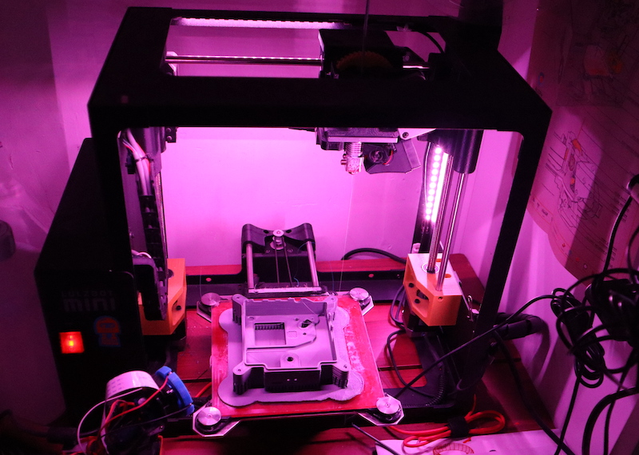
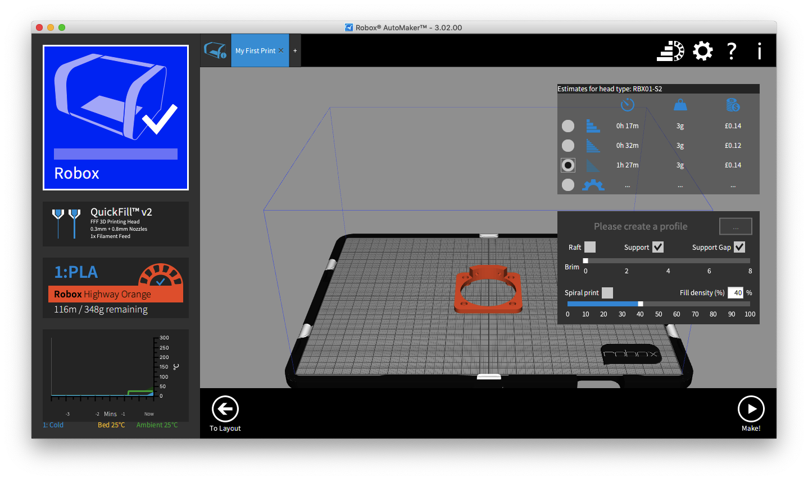
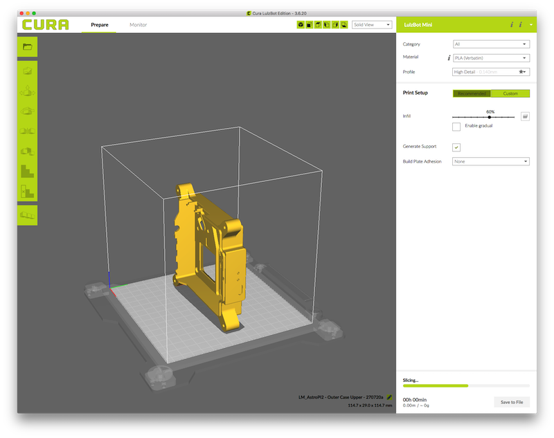
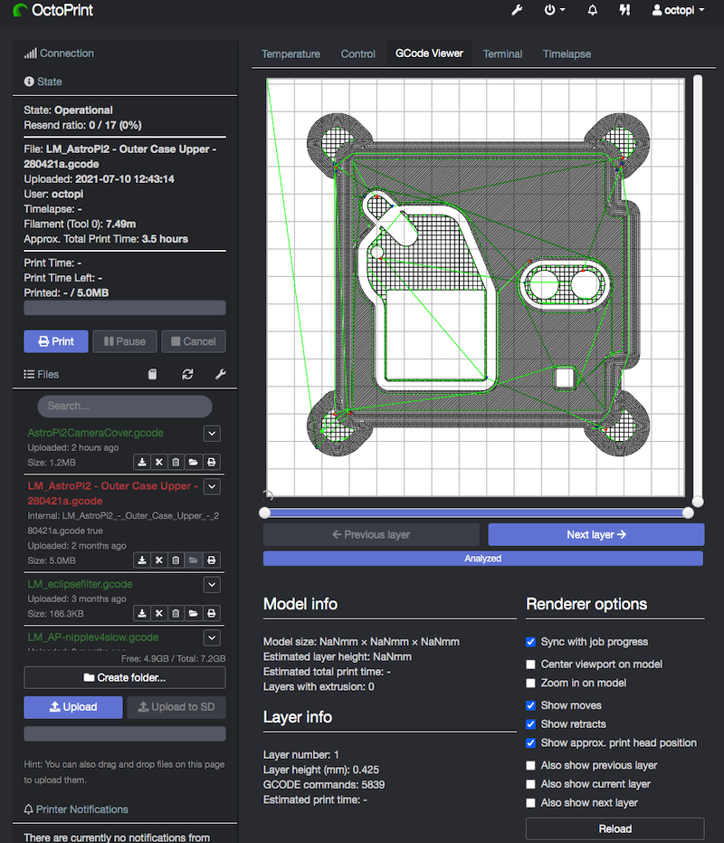
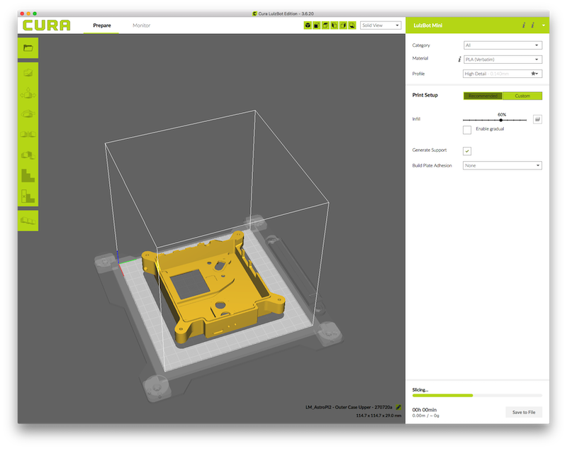
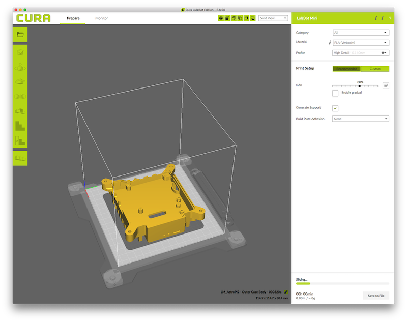
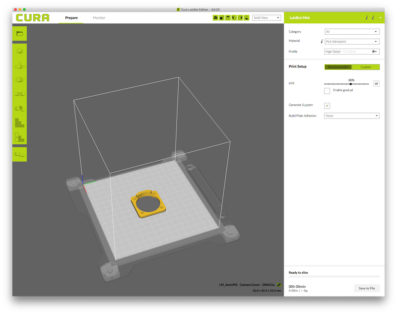
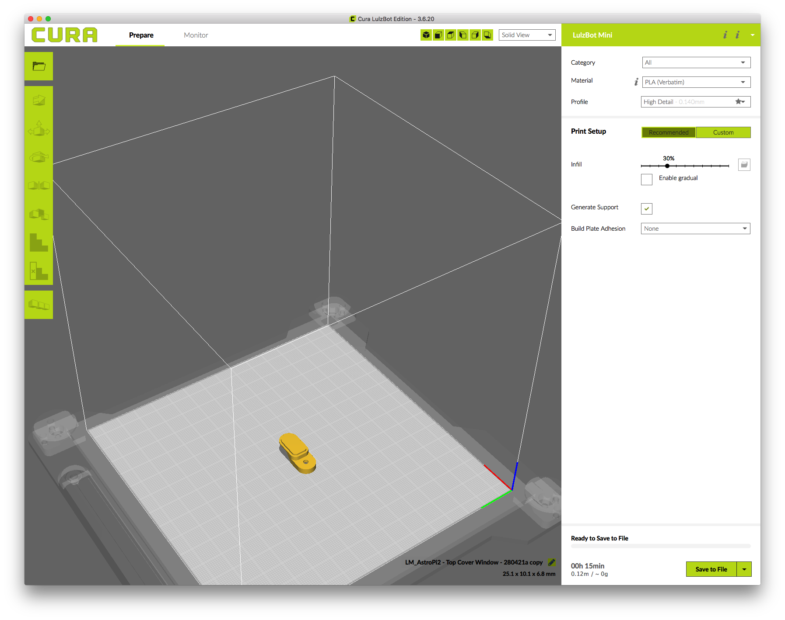

## Print each part

**It is important that you observe the correct safety procedures specified in the data sheet for your specific 3D printer.**

Potential hazards include:

- Hot surfaces and thermoplastics (print head block and bed)
- Moving parts (printing assembly)

We tried this project on a range of 3D printers including:

 - [Cel Robox](https://cel-uk.com/shop/roboxdual/){:target="_blank"}.
 - [Lulzbot Taz 6](https://www.lulzbot.com/store/printers/lulzbot-taz-6)
 - [Lulzbot Mini](https://www.lulzbot.com/store/printers/lulzbot-mini)

We mainly used PLA filament in our prints, but we have also printed test cases using ABS.  There are many different 3D printer models, so you should make any necessary adaptations to the instructions in order to get the best results from your particular machine.  

All parts except for the joystick cap will need to be printed with support scaffolding as there is no completely flat surface with any orientation. For most printers, you may also wish to add a raft as this may make it much easier and quicker to remove the scaffolding, especially from the heat sink fins on the Flight Case base. It also prevents heat warping and can be useful for the joystick and leg parts. It will, however, increase the print time. 

--- task ---

The STL files have been generated from the original CAD designs used to make the Mark II aluminium Flight Cases on the International Space Station. 

Depending on your printer and how you use it, you may be able to load these files into a software application that can directly control the hardware and will manage the entire process for you. In the image below, you can see the STL file for the camera mount loaded directly into the Cel Robox application.

Or if you use a web interface or other client software such as [Octoprint](https://octoprint.org/) to control a [FDM/FFF printer](https://en.wikipedia.org/wiki/Fused_filament_fabrication#Fused_deposition_modeling), you may need to use separate slicing software like [Cura](https://github.com/Ultimaker/Cura), which will convert the model into a series of thin layers to produce a G-code file containing instructions. The image below is from the popular Cura slicing application.

--- /task ---

--- task ---
This G-code file can then be printed via the client software, which will load the G-code and use it to instruct the printer during the 3D printing process.

To get a nice finish, we recommend you print on a high detail setting; this is usually a number specified in [microns](https://en.wikipedia.org/wiki/Micrometre){:target="_blank"} in the 3D printer software. The lower this number is, the more precise the model will be. Please also be aware that precise prints take longer and, for the models you're going to make, each piece can take up to **ten hours** to complete. Make sure you have enough filament.

Having said that, our test cases were also printed using the default "medium quality" settings for the printers and they look fine. 

--- /task ---

--- task ---

Whether you're using an application that can work directly from the STL file, or creating a G-code file using slicing software, you should make sure you adjust the orientation of the parts on the virtual printer bed so that they lay flat as shown below. This will minimise scaffolding and rafting.

--- /task ---

--- task ---

Once you've checked all the various options, start your print job. Remember that some of the parts may take several hours to complete and use a fair amount of material. So make sure you have enough time and filament available.

--- /task ---
