## Remove the scaffolding

When the parts have finished printing, try to remove them from the bed of your printer keeping the raft attached. Leave the print to cool right down to room temperature before you touch it.

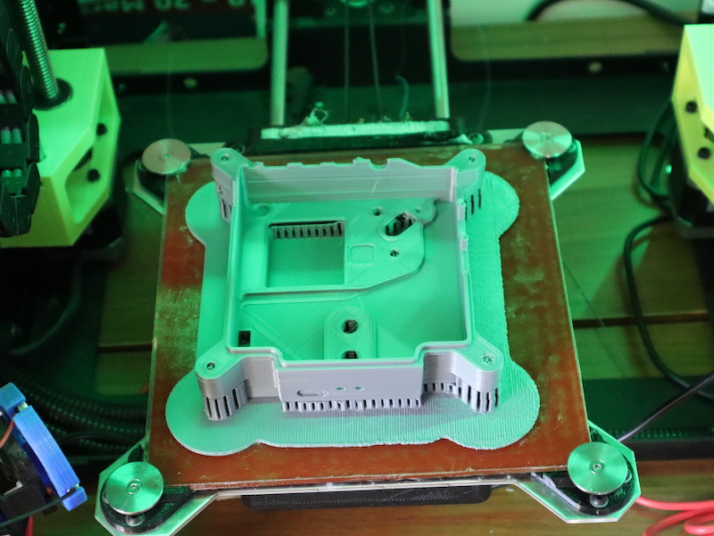

In order to keep the model structurally sound while printing, your 3D printer will create what's called scaffolding and rafting to prevent the hot thermoplastics from bending or sagging. 

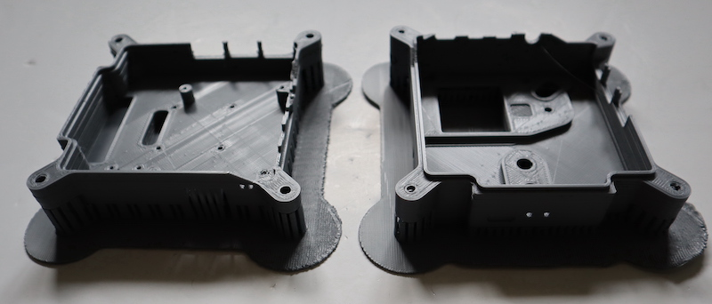

### Flight Unit Front panel

If you've printed this part with a raft, you should be able to separate the raft from the base and carefully peel it away so that it also takes the scaffolding with it. 

--- task ---

Start by freeing the scaffolding at the corners using a small pair of pliers.

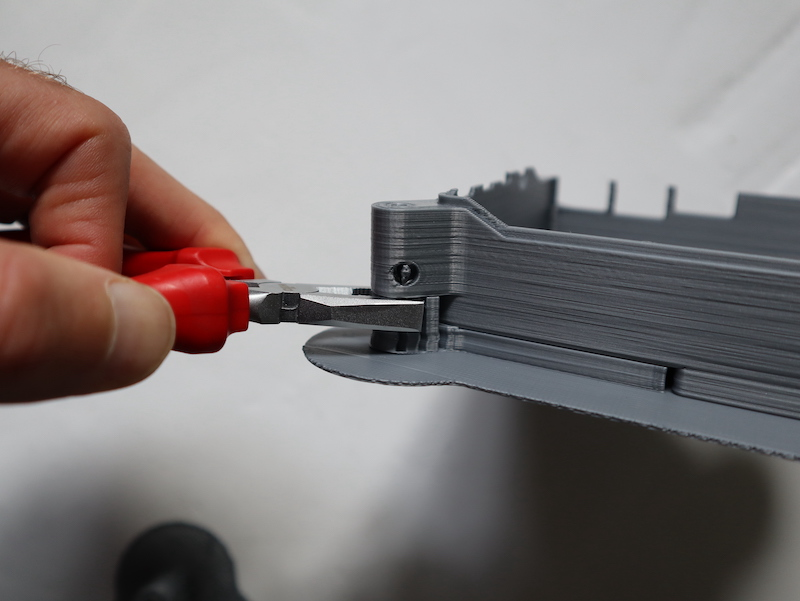

--- /task ---

--- task ---
Then use your fingers to prise the raft from the base. You may need to carefully slip a craft knife blade into the gap to get things started. 

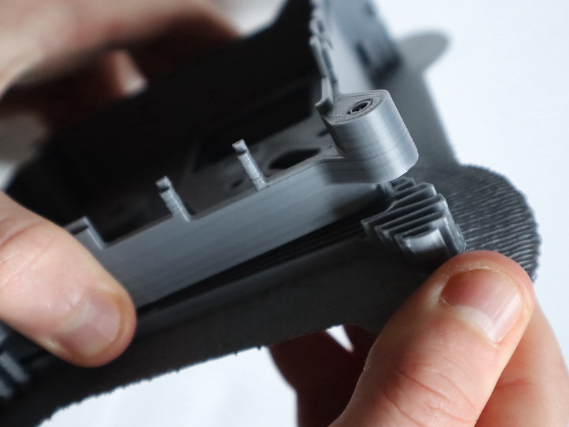

--- /task ---

--- task ---
Begin to peel back the raft, checking that the scaffolding is being removed with it.

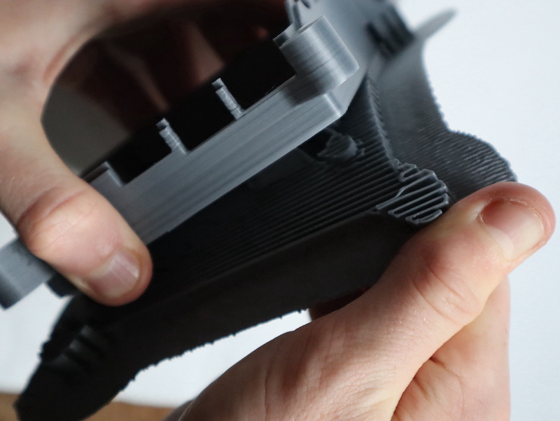

Continue slowly peeling the raft away.

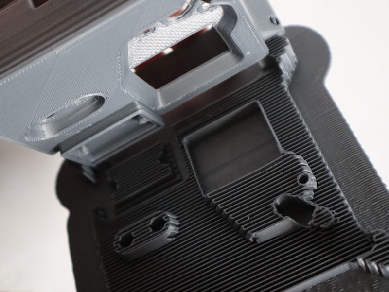

--- /task ---

If you didn't use a raft for you print, there are three main scaffolding areas to deal with. 

--- task ---

Start with the area beneath the LED matrix window. You should be able to slide a craft knife or small screwdriver under the lip of the scaffold and peel it away

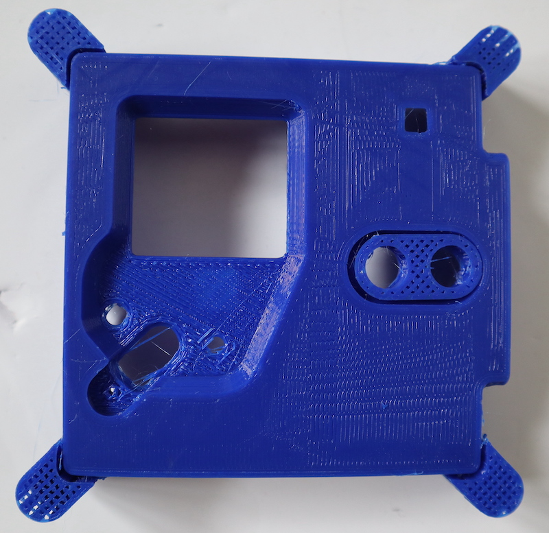

--- /task ---

--- task ---

Then do the same thing with the region around the button holes. 

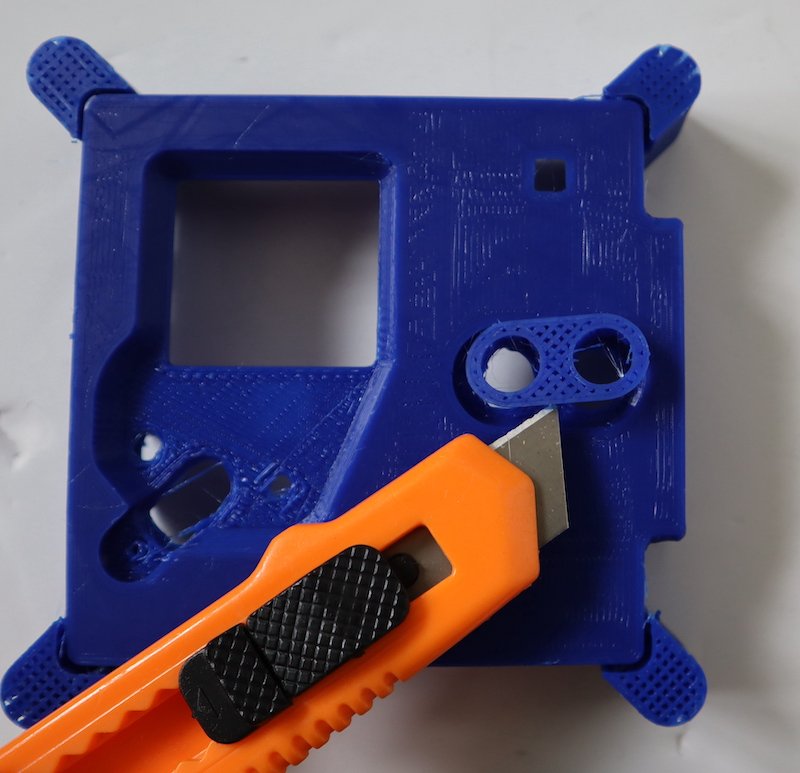

--- /task ---

--- task ---

Finally, tackle the scaffold pieces on the corners. You may need a pair of small pliers to get a strong enough grip, but then the scaffold should just snap off cleanly.  

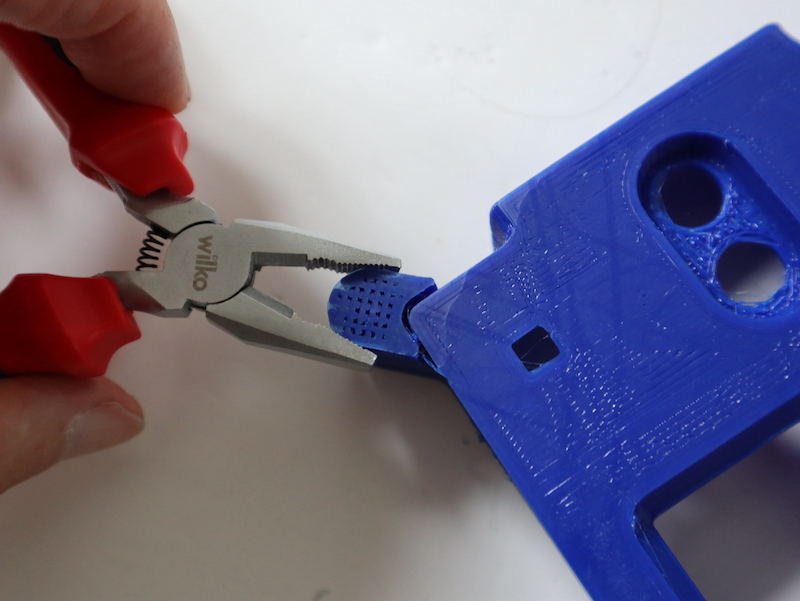

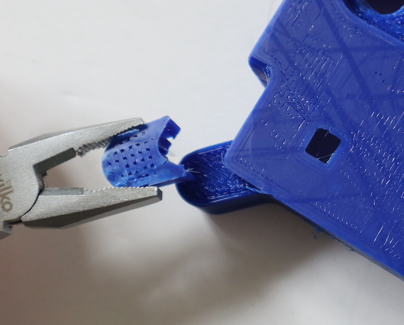

--- /task ---

### Flight Unit Base

--- task ---

If you've printed this part with a raft, you should be able to separate the raft from the base and carefully peel it away so that it also takes the scaffolding with it.  Do this very carefully to prevent the individual fins of the heatsink from breaking away. If you do accidentally break one off, it is normally possible to re-attach with superglue, rather than re-printing the whole panel. 

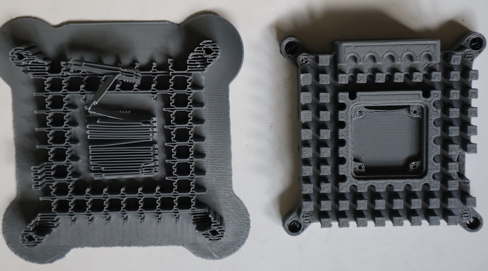

--- /task ---

If you didn't use a raft, then you will need to peel away the scaffolding in sections.

--- task ---

The base scaffolding should come away easily if you remove it it sections. Before you start, carefully use a craft knife or scalpel to split the sides of the fins away from the scaffold.  

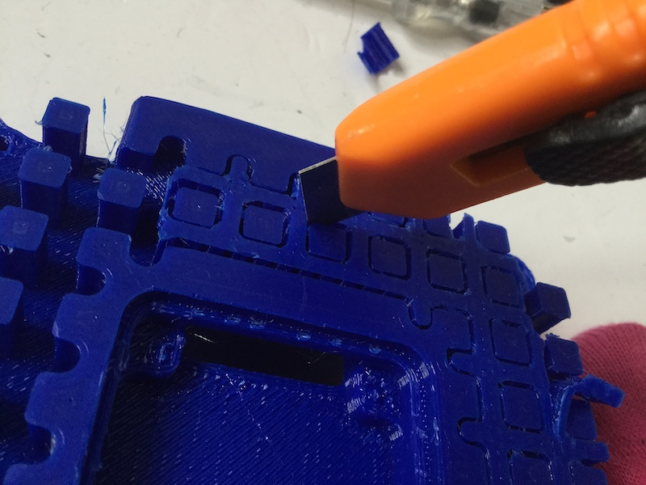

You can also use a narrow flat screwdriver as aa level to free the scaffold from the case itself. It should require little force and be careful not to snap off any of the fins.

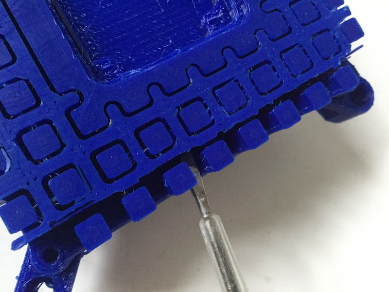
--- /task ---

--- task ---

Don't forget to clear the material around the SD card slot; this can be done easily using a small screwdriver.

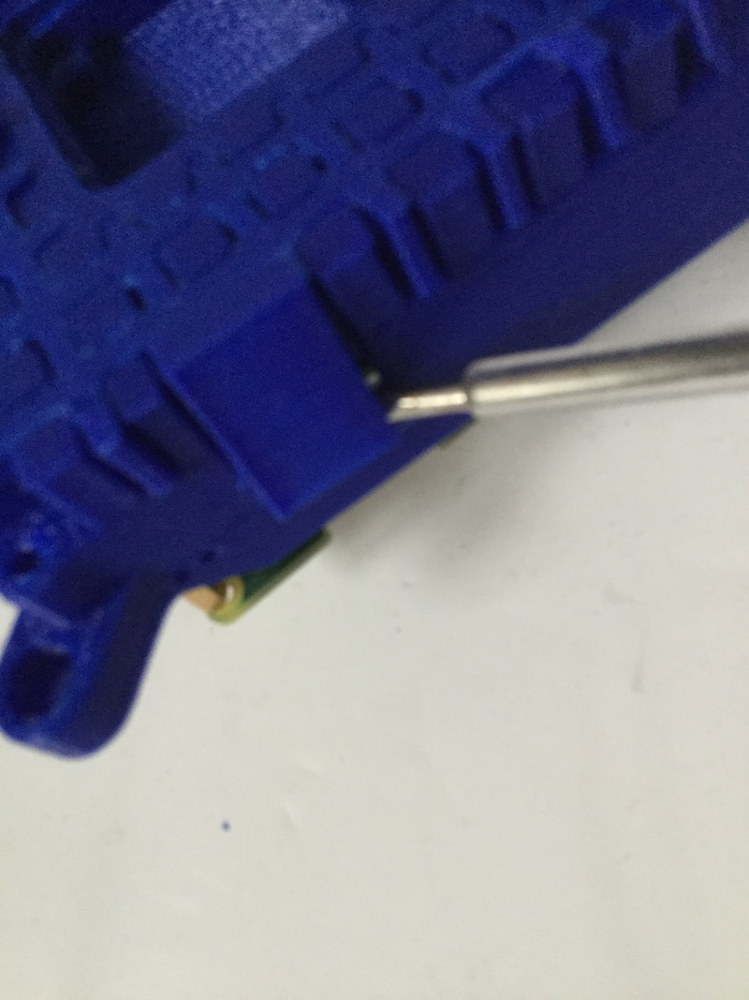

--- /task ---

--- task ---
Once you find that sections of the scaffold have become severed from the rest and the base, carefully slip them off the fins. You can also use a craft knife to cut the scaffolding into sections for easy removal in stages. 
--- /task ---

[Photo of the blue 3D printed base part with all but one section of the scaffolding removed](images/scaffold_sections.jpg)

--- task ---
Once again, carefully use a craft knife or scalpel to split the sides of the scaffold filling the recess for the HQC.

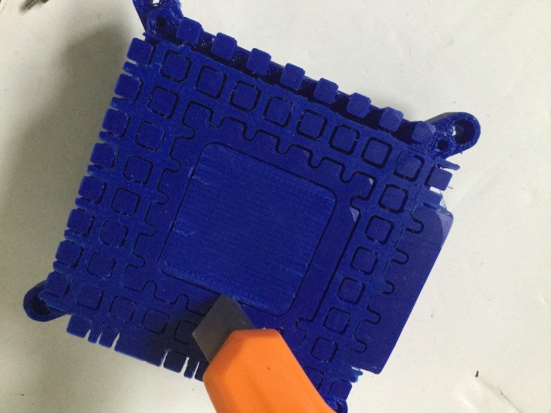

--- /task ---

--- task ---
A small flat head screwdriver can be used to start to lift one edge of the scaffold

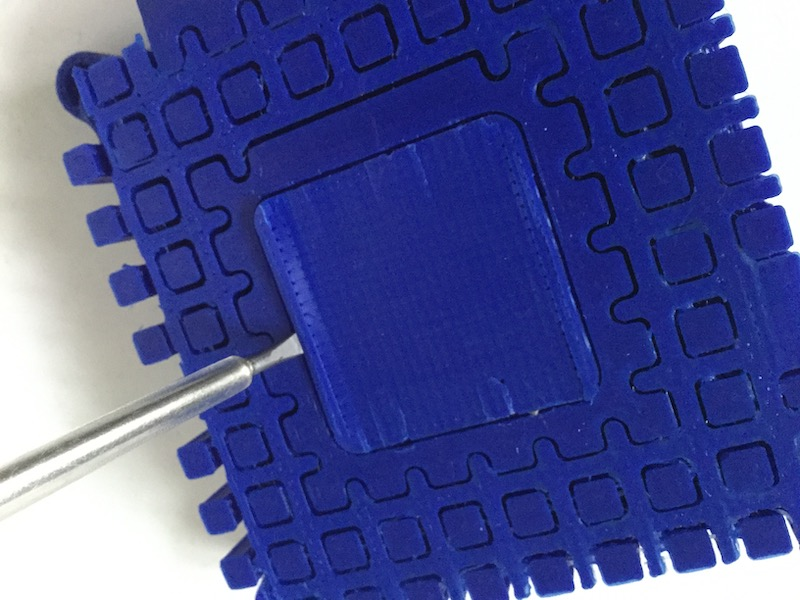

--- /task ---

--- task ---
The scaffolding should come away easily if you peel it with your fingers. 

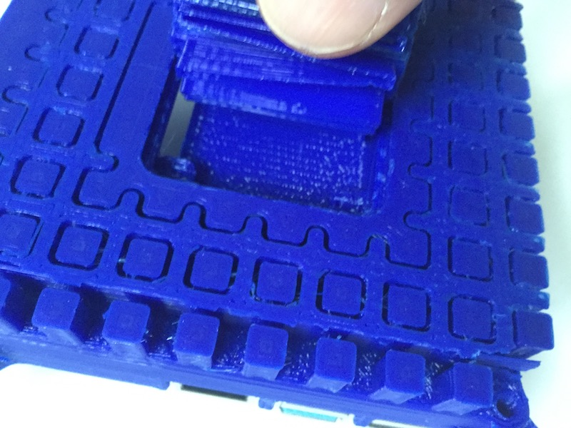

--- /task ---

### HQC mount

--- task ---

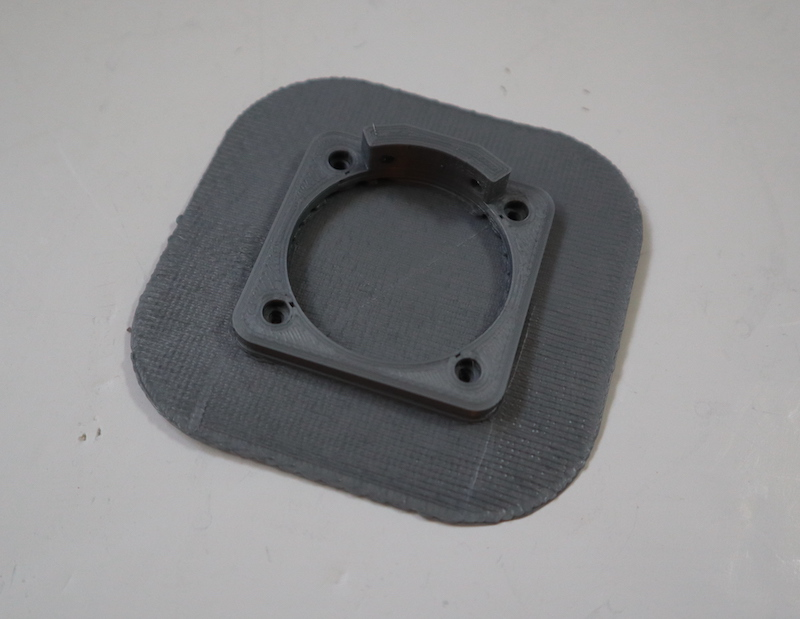

If you used a raft, the scaffolding should come away easily if you peel off the raft with your fingers. 

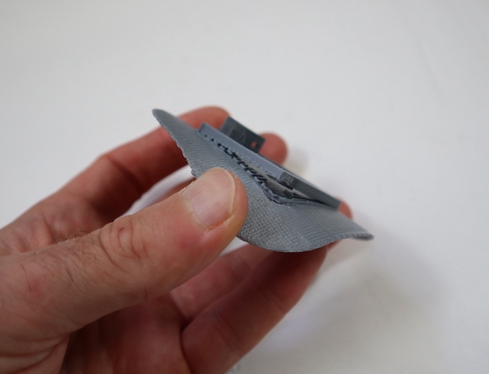

--- /task ---

### Light sensor window

--- task ---

The small piece of support material should easily break away from the window. You may need to remove some additional material from the hole. 

--- /task ---

## Do a fit check

--- task ---
Before proceeding, put all the pieces together to check that they fit correctly. The lipped edge between the base and top pieces is of most concern to you here. The HQC camera mount needs to fit snugly into the base.

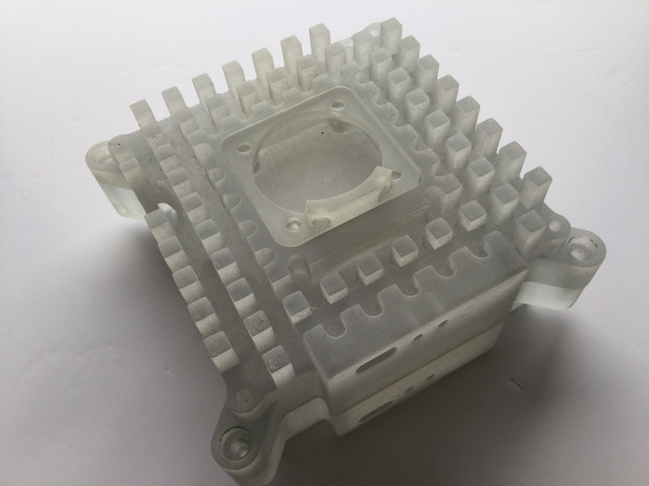

Don't worry about any imperfections or residue from the scaffolding at this stage; you can tidy this up later with sandpaper.
--- /task ---