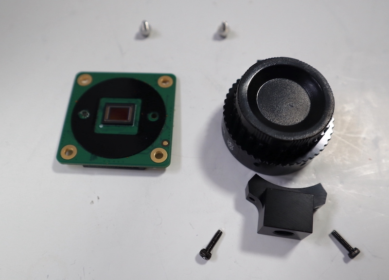
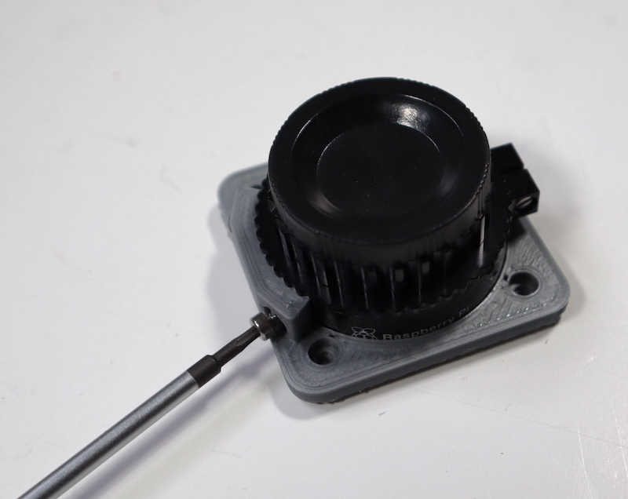
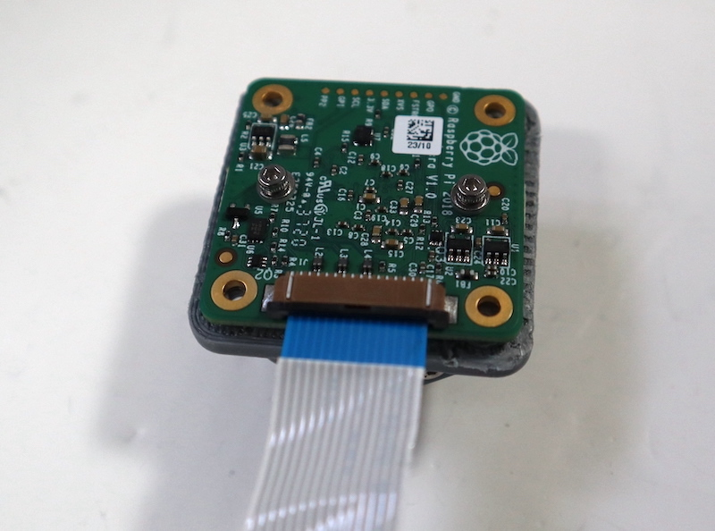

## Install the camera

When you're happy with the 3D-printed parts, you can proceed to the hardware installation.

--- task ---
First, lift the two tabs on either side of the High-Quality Camera (HQC) to re-connect the ribbon cable from the camera.
--- /task ---

--- task ---

Second, remove the tripod mount from the HQC sensor by unscrewing the two bolts that attach it. You'll need a 1.5mm allen key for this task. 

--- /task ---

--- task ---
Next, unscrew the two 1.5mm hex lock keys on the underside of the main circuit board. Be careful not to let the washers roll away. There is a gasket of a slightly sticky material between the housing and Printed Circuit Board (PCB), which will require some force to separate.

Lift up the board and place it face up on a very clean surface. Make sure the sensor (the small square in the middle) does not touch the surface.

--- /task ---

--- task ---

Slide your 3D-printed camera mount part around the black metal surround of the HQC sensor. Secure it in place by lining up the holes in the bottom lip of the 3D-printed part with the holes for the tripod mount. Attach using two M2 x 5mm screws (note you cannot use the original screws that held the tripod mount in place as they are too long).

--- /task ---

--- task ---
Replace the main housing over the circuit board. Be sure to realign the housing with the gasket, which remains on the circuit board.

[Photo showing the Raspberry Pi HQC PCB aligned back on the mount.](images/HQC_no_screws.jpg)

The nylon washer prevents damage to the circuit board; apply this washer first. Next, fit the steel washer, which prevents damage to the nylon washer.

Screw down the two hex lock keys. As long as the washers have been fitted in the correct order, they do not need to be screwed very tightly.

--- /task ---

--- task ---

Now, lift the two tabs on either side of the High-Quality Camera to re-connect the ribbon cable from the camera. Note the blue side of the cable should be facing upwards, away from the PCB as shown. 

--- /task ---

--- task ---

Slip the cable through the slit in the base. Make sure you have the correct orientation so that the blue side will face the bottom of the case when folded.

--- /task ---

--- task ---
Slot the camera mount into place. It will be a tight fit, so make sure that any excess scaffolding has been removed from the part itself and from the cavity in the larger case part in which it sits.

--- /task ---

--- task ---
Fold the ribbon and lay it flat along the inside of the base part. Secure it with a small piece of tape as shown. We have used Kapton tape, but any kind of tape will work fine.

--- /task ---

--- task ---

Use M2 × 16 screws and M2 nuts to secure the camera mount to the base. The nuts should be on the inside of the case. 

--- /task ---

