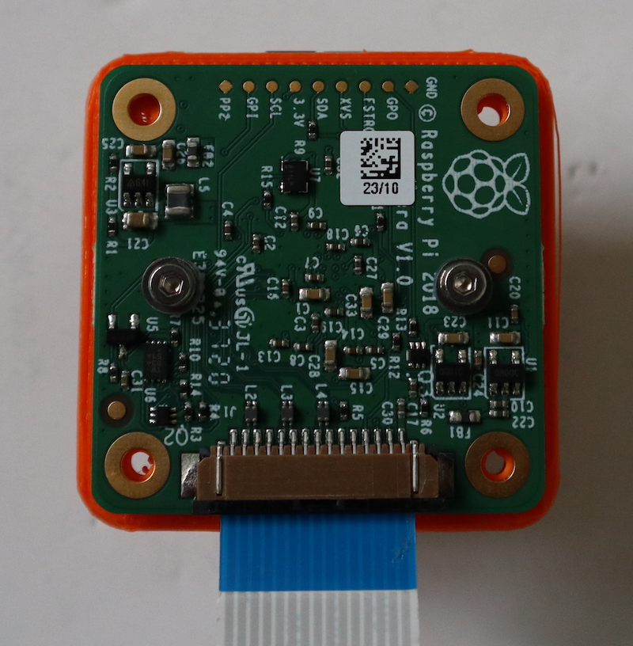
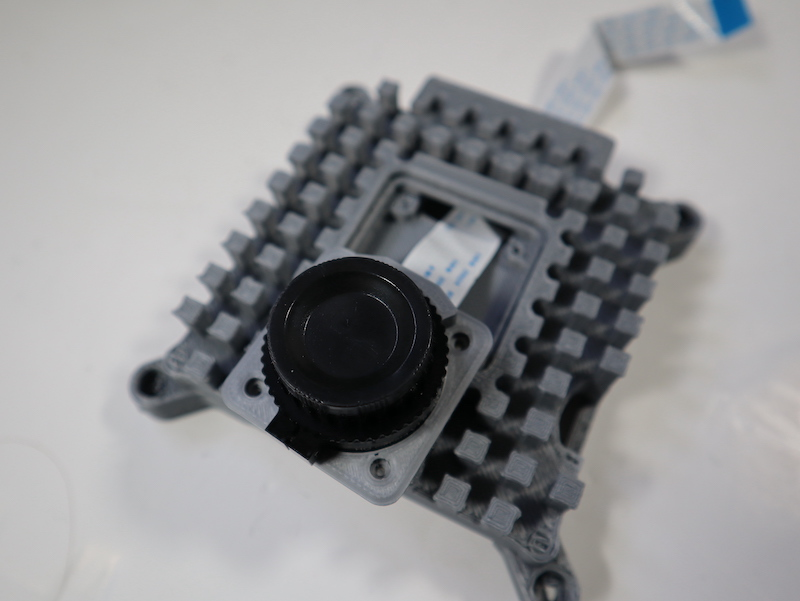
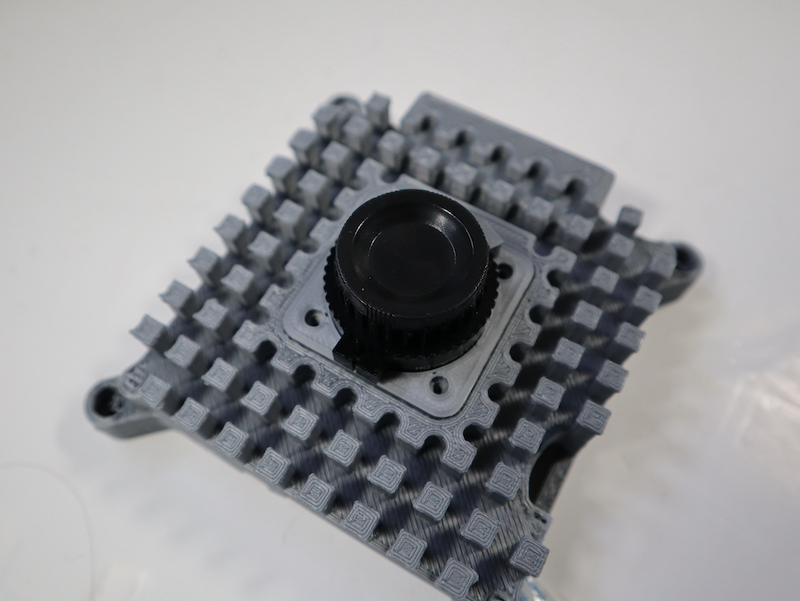

## Install the camera

When you're happy with the 3D-printed parts, you can proceed to the hardware installation.

--- task ---
Firstly lift the two tabs on either side of the High Quality Camera to re-connect the ribbon cable from the camera.
--- /task ---

--- task ---

Firstly, remove the tripod mount form the HQC sensor by unscrewing the two bolts that attach it. You'll need a 1.5 mm allen key for this task. 

--- /task ---

--- task ---
Next, unscrew the two 1.5 mm hex lock keys on the underside of the main circuit board. Be careful not to let the washers roll away. There is a gasket of slightly sticky material between the housing and PCB which will require some force to separate.

Lift up the board and place it face up on a very clean surface. Make sure the sensor (the small square in the middle) does not touch the surface.
--- /task ---

--- task ---

Slide your 3D printed camera mount part around the black metal surround from the HQC sensor. Secure it place by lining up the holes in the bottom lip of the 3D printed part with the holes for the tripod mount. Attach using 2 XX screws (note you cannot use the original screws which held the tripod mount in place as they are too long)

--- /task ---

--- task ---
Replace the main housing over the circuit board. Be sure to realign the housing with the gasket, which remains on the circuit board.

The nylon washer prevents damage to the circuit board; apply this washer first. Next, fit the steel washer, which prevents damage to the nylon washer.

Screw down the two hex lock keys. As long as the washers have been fitted in the correct order, they do not need to be screwed very tightly.

--- /task ---

--- task ---

Now lift the two tabs on either side of the High Quality Camera to re-connect the ribbon cable from the camera. Note the blue side of the cable should be facing as shown. 

--- /task ---

--- task ---

Slip the cable through the slit in the base. Make sure you have the correct orientation so that the blue side will face the bottom of the case when folded as shown below

--- /task ---

--- task ---
Slot the mount into position in the recess in the underside of the base part.  

--- /task ---

--- task ---
Then fold the ribbon and lay flat along the inside of the base part. Secure it with a small piece of tape as shown. We have used Kapton tape, but any kind of tape will work fine.

--- /task ---

--- task ---
Slot the camera mount into place. It will be a tight fit, so make sure that any excess skaffolding has been removed from the part itself and the cavity in the larger case part into which it sits. 

--- /task ---

--- task ---

Use XX screws and nuts to secure the camera mount to the base. The nuts should be on the inside of the case. 

--- /task ---

 Furthermore, try to avoid removing and re-threading the screws, as doing so will cut a new thread and, if done repeatedly, will erode the inside of the support pillar so that the screws will not hold.
