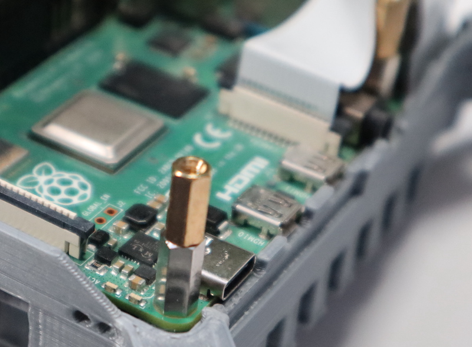

## Install the Raspberry Pi 4 

--- task ---

Firstly, ensure there's no residual scaffolding material around the SD card slot or LED holes that might prevent the Raspberry Pi from lining up with the mounting pillars.

--- /task ---

--- task ---

Once you're happy, line the Raspberry Pi up and do a fit check.  Don't insert the camera ribbon cable just yet.

--- /task ---

--- task ---

Next, screw the M2.5 11mm spacer stand-offs into each corner of the Pi. With some light finger pressure they will cut their own thread in the support pillar pilot holes.

After a few turns you'll need to use a small pair of pliers or a nut-driver to continue turning them. Try to get the stand-offs to go into the support pillars straight down, and not at a slight angle, because that can lead to alignment issues with the Sense HAT later on. Be careful while you do this and, again, stop turning as soon as the stand-off touches the Raspberry Pi to avoid splitting the pillars horizontally along the grain of the print.

If you are having trouble screwing in the stand-offs, screw one of the silver M2.5 cross-head screws into the stand-off, then use the screw head to screw the stand-off into the case. Once the stand-off is in place, don't forget to remove the screw.

--- /task ---

--- task ---

You can now insert the camera ribbon cable into the CSI port of the Raspberry Pi. 

--- /task ---

### Install stand-offs for the Sense HAT

The Astro Pi Flight Units onboard the ISS have another custom circuit board in between the Raspberry Pi and Sense HAT which holds a real-time clock with backup battery. This mezzanine board also has some pins to allow easy connection to the push-buttons and the PIR. Unfortunately, the board is not mass-produced and available to the public.

Instead you can use another level of spacers to support the Sense HAT at the correcet height.

--- task ---

Add an M2.5 x 10mm spacer to each of the 11mm spacers already installed 

--- /task ---
