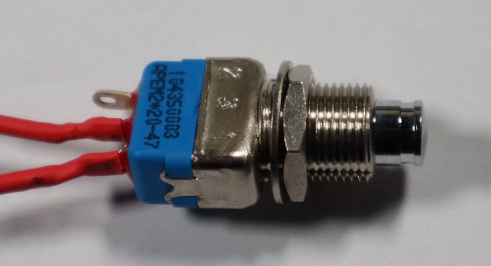

## Solder and install the push buttons

We have created two different front panel options to accommodate two popular sizes of buttons. Most of the photos show the shiny APEM SPDT Momentary Push Buttons as used on the ISS Flight Units. However, you can use any similar button as long as it has the correct thread for the version of the Flight Case that you have printed. You may need to adapt the tasks in this section to reflect the buttons you have chosen.

### Solder the button wires

First, you need to prepare the button wires to be able to attach them to the buttons. In the real Flight Unit, we soldered the button wires on to make them more reliable. This is the most straightforward method, but you could also use connectors if you desire a less permanent solution. The colour of the wires is not important, as they are all exactly the same inside.

--- task ---

Take a coloured wire and remove the black plastic sheath from **one** end. If your wire has a one pointy (M) end, and one end with a hole (F), you should remove the M end connector. You can do this by pulling it off with pliers, or by cutting the wire just below the connector. Strip back approximately 1cm of the insulating sheath from your wire. Repeat this for three additional wires. 

--- /task ---

--- task ---

The APEM buttons have three terminals. You're going to connect wires to only two of these, but they need to be the correct ones. The switch between the terminals labelled 1 and 3 is closed when the button is pressed, and these are the terminals to which you should connect your wires.

--- /task ---

--- task ---

Twist the exposed copper wires so that all the individual strands are tightly entwined. Then thread the end through a small (1cm long) piece of heat shrink tubing. 

--- /task ---

--- task ---

Secure a button using a vice, a set of "helping hands" (not attached to a human), or just a blob of sticky tack, to hold it steady while you solder.

Thread a wire through one of the correct terminals (see above) and loop it over as shown below. Carefully [solder](https://www.raspberrypi.com/news/getting-started-soldering/) the wire to the terminal. 

Before the solder cools and hardens, pull the wire gently upwards so that it is pointing straight up. This will make it much easier to slide the heat shrink tubing down.

--- /task ---

--- task ---

Slide the heat shrink tubing down over the terminal. Make sure any loose strands of wire are tucked up under sleeve to prevent accidental shorting of the buttons. 

--- /task ---

--- task ---

Now repeat these steps for the second terminal, and then for the second button.

--- /task ---

--- task ---

Use a heat gun to soften and shrink the heat shrink tubing. 

--- /task ---

--- task ---

If you are using different buttons, the process should be the same, although you will possibly have only two terminals on the button. 

Use heat shrink tubing to protect the contacts in the same way.

--- /task ---

--- task ---

Once you have soldered all the button wires, use a heat gun to shrink the heat shrink tubing, making sure any loose strands of wire are tucked under the tubing and not able to create a short circuit between the terminals. 

--- /task ---

### Install the buttons into the front panel

Most buttons suitable for the Flight Unit will have a locking nut that holds them in place. 

The description below is for the APEM buttons but it should be similar for most other compatible choices. The APEM buttons came with four different fastenings.

--- task ---

Take a button, then unscrew and remove all the nuts and washers. The picture below shows the fastenings next to numbers, which will be used to identify each one in the steps below. 

--- /task ---

--- task ---

Put the locking clip (3) back on first, followed by the hexagonal locking nut (1). You can discard the gripping ring (4).

--- /task ---

--- task ---

Slide the button through the hole in the front panel. Secure it with the circular locking ring (2). 

--- /task ---

--- task ---

Repeat the steps above with the second button. 

--- /task ---
