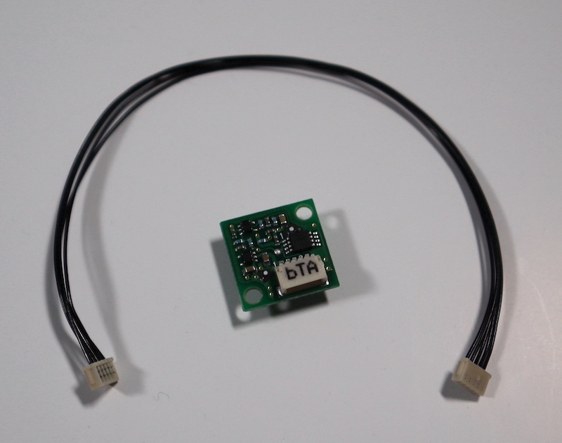
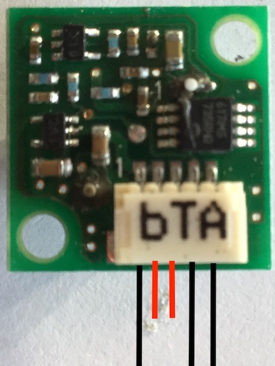
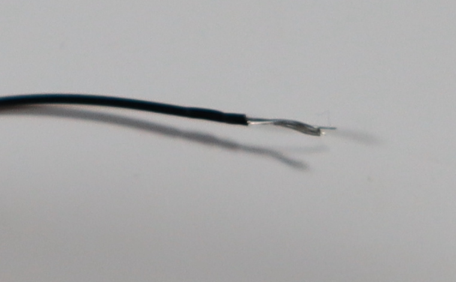
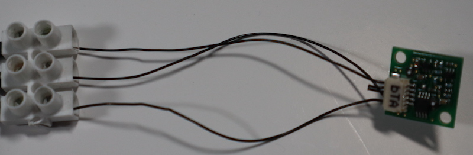
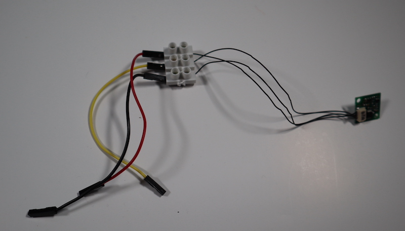
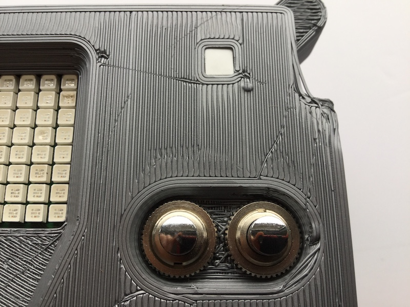
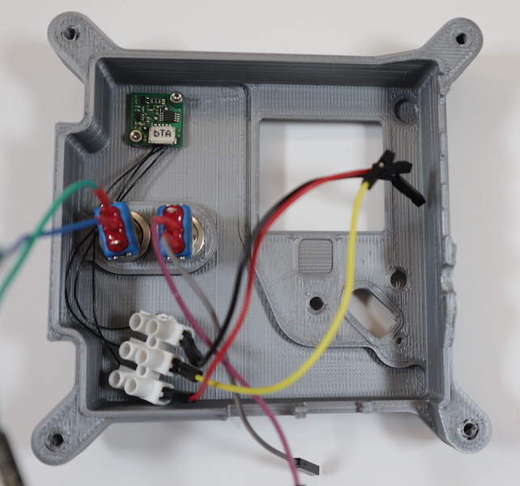
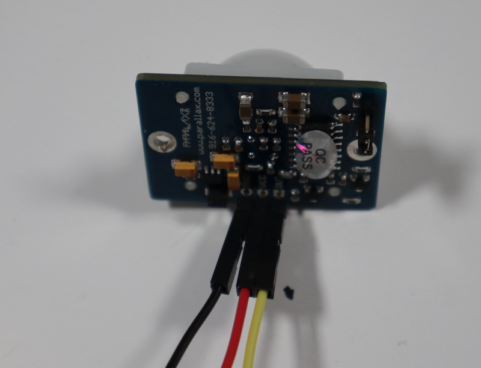
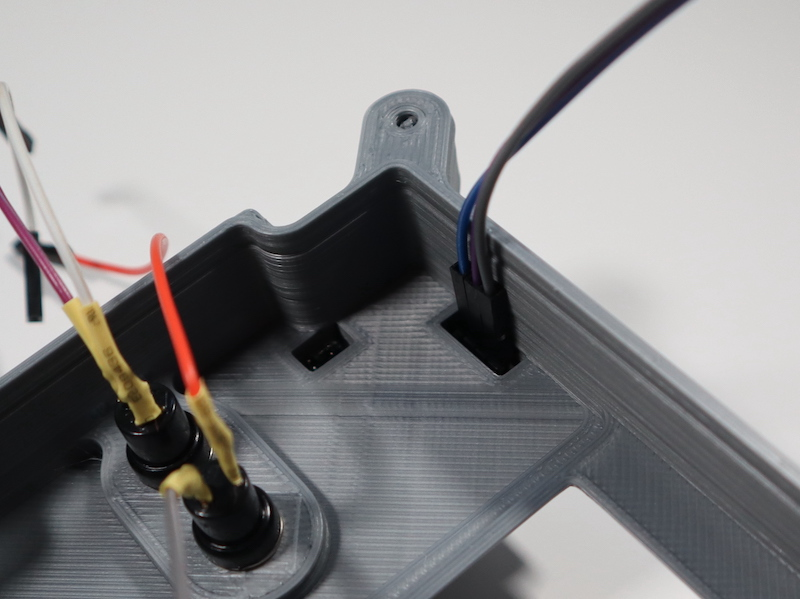

## Install the PIR sensor

There are two different steps to follow here, depending on which PIR you are using. You should have printed the correct Flight Case front panel to go with your choice of PIR.

### Option 1: Kemet PIR sensor

This is the small, square PIR used on the ISS Astro Pis. It requires a specific matching cable which needs to be modified to allow connection to the Raspberry Pi's GPIO pins. 

The sensor has an unusual 5-pin JST-type connector and requires a matcging cable. Unfortunately there is no easy way to use this connector directly with the Raspberry Pi GPIO pins. The Flight Units on the ISS have dedicated header pins on the mezzanine board to enable this connection. This cable has 5 individual strands of wire. 

One option is to remove the connecor for one end of the cable and solder the bare wire to another wire with a the female dupont connector at the other end. However the PIR cable's individual wires are very fine and this is not an easy teask, and damage to the expensive cable is likely. A less risky method is described below.

--- task ---

Cut the connecter off of one end of the PIR cable.

--- /task ---

--- task ---

Only 3 of the individual wire strabds are needed, so snip off the two redundent ones. Make sure you have the oriented correctly the PIR and that you only snip the strands that are not needed. 

--- /task ---

--- task ---

Trim the remaining wires by 30mm. Then carefully strip about 7-10mm of insulation from the end of each strand. 

--- /task ---

--- task ---

Cut 3 segment block from an electrical terminal connector strip and insert the bare wire ends of the each strand into seperate blocks. Tigten the screws and make sure the wires are secured fastened. 

--- /task ---

--- task ---

Connect three individual M-F Dupont jumper wires to the other side of the connecgtor block. You should be able to screw down onto the pointy bit of the male end of each wire.

Once you've connected the PIR itself, you complete assembly should look like this:

--- /task ---

--- task ---

Insert the PIR into the hole in the front panel of the Flight Case and fix it in place using 2 M2.5 x 3mm screws. You may need to remove any excess melted filament from the holes first.  

Place the PIR cable to the right of the pair of buttons. 

--- /task ---

### Option 2: Parallax PIR sensor

This is the domed PIR that is supplied in the Mission Space Lab kits.

--- task ---

Connect three individual M-F Dupont jumper wires to the pins on the back of the PIR PCB. 

--- /task ---

--- task ---

Feed the wires through the slot in the top right corner of the Flight Case front panel. 

--- /task ---

--- task ---

Flip the Flight Case front panel over and seat the PIR in the rectangular slot in the top right corner.  Secure with 2 M2.5 x 6mm screws. You may need to remove any excess melted filament from the holes first.  

--- /task ---