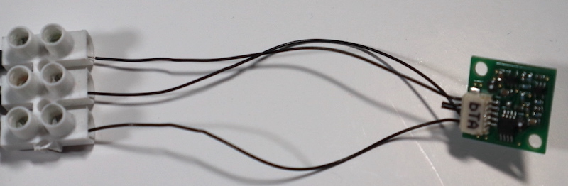

## Install the PIR sensor

There are two different steps to follow here, depending on which PIR sensor you are using. You should have printed the correct Flight Case front panel to go with your choice of PIR sensor.

### Option 1: Kemet PIR sensor

This is the small, square PIR sensor used on the ISS Astro Pis. It requires a specific matching cable, which needs to be modified to allow connection to the Raspberry Pi's GPIO pins. 

The sensor has an unusual five-pin JST-type connector and requires a matching cable: this cable has five individual strands of wire. Unfortunately, there is no easy way to use this connector directly with the Raspberry Pi GPIO pins. The Flight Units on the ISS have dedicated header pins on the mezzanine board to enable this connection. 

One option is to remove the connector for one end of the cable and solder the bare wire to another wire with an F Dupont connector at the other end. However, the cable's individual wires are very fine and this is not an easy task, and damage to the expensive cable is likely. A less risky method is described below.

--- task ---

Cut the connecter off of one end of the PIR cable.

--- /task ---

--- task ---

Only three of the individual wire strands are needed, so snip off the two redundant ones. Make sure you have correctly oriented the PIR sensor and that you only cut the strands that are not needed (shown in red below). 

--- /task ---

--- task ---

Trim the remaining wires by 30mm. Then, carefully strip about 7–10mm of insulation from the end of each strand. 

--- /task ---

--- task ---

Cut a three-segment block from an electrical terminal connector strip and insert the bare wire ends of each strand into separate blocks. Tighten the screws and make sure the wires are securely fastened. 

--- /task ---

--- task ---

Connect three individual M-F Dupont jumper wires to the other side of the connector block. You should be able to screw down onto the pointy bit of the M end of each wire.

Once you've connected the PIR sensor itself, your complete assembly should look like this:

--- /task ---

--- task ---

Insert the PIR sensor into the hole in the front panel of the Flight Case and fix it in place by using two M2.5 × 3mm screws. You may need to remove any excess melted filament from the holes first.  

--- /task ---

--- task ---
Place the PIR cable to the left of the pair of buttons. 

--- /task ---

### Option 2: Parallax PIR sensor

This is the domed PIR sensor that is supplied in the Mission Space Lab kits.

--- task ---

Connect three individual M-F Dupont jumper wires to the pins on the back of the PIR sensor PCB. 

--- /task ---

--- task ---

Feed the wires through the slot in the top-right corner of the Flight Case front panel. 

--- /task ---

--- task ---

Flip the Flight Case front panel over and seat the PIR in the rectangular slot in the top-right corner. Secure with two M2.5 × 6mm screws. You may need to remove any excess melted filament from the holes first.  

--- /task ---
