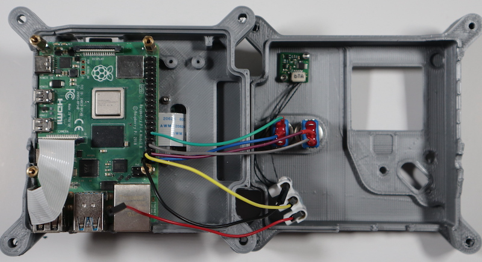

## Connect internal wiring to the Raspberry Pi

As previously mentioned, the ISS Astro Pis have an additional PCB to provide connection points for the buttons and PIR. As this custom board is not available commercially, you will need a different approach.

Fortunately, the [Raspberry Pi Sense HAT only uses GPIO pins](https://pinout.xyz/pinout/sense_hat) from the first 24 on the header. This allows us to use a 26 pin header extender to mount the Sense HAT, leaving the remaining 16 pins free.

However, we still need a 3V3 pin for the PIR sensor. Of the two 3V3 pins available, only pin number 1 is actually used by the Sense HAT, so we can use pin number 17.

GPIO-Pinout-Diagram-2.png

--- task ---

Take the 26-pin tall header and carefully use radio pliers to bend the ninth pin on one side through 90 degrees. 

--- /task ---

--- task ---

Place the top and bottom halves of the Flight Case side by side and connect the button wires to the GPIO pins. One button from each wire should go to a ground pin, the other to a numbered GPIO pin. You can use whichever combination you like, but we recommend:

| Wire  |  GPIO pin | Physical pin number
|---|---|---|
| Button A  |  20 | 38 |
| Button A  |   | 34 |
| Button B  |  21 | 40 |
| Button B  |   | 30|

--- /task ---

--- task ---
Do the same thing with the ground pin and signal wires from the PIR sensor.

| Wire  |  GPIO pin | Physical pin number
|---|---|---|
| Ground |   | 39 |
| Signal/Out | 26  | 37 |

--- /task ---

## Install the Sense HAT

--- task ---

Remove the GPIO connector that comes with the Sense HAT. You can wiggle it from side to side, and it will come off without too much force.

--- /task ---

--- task ---
Insert the header into the Sense HAT, through physical pins 1–26 as shown. Make sure the bent pin is facing inwards, underneath the PCB.

  

Note that the header pins should not protrude through the top of the Sense HAT. If they do, then the height is not correct.

--- /task ---

--- task ---

Connect the remaining 3V3 wire from the PIR sensor to the bent pin on the header.

--- /task ---

--- task ---

Seat the Sense HAT onto the Raspberry Pi. Make sure the orientation is as shown below. Be careful to align both rows of pins with both rows of holes in the header.

--- /task ---

--- task ---

Fix the Sense HAT in place with four M2.5 × 6mm screws.

--- /task ---

--- task ---

To check that the Sense HAT is connected correctly, at this stage it is a good idea to insert a bootable SD card into the Raspberry Pi and connect the USB-C power cable.

If you have an Astro Pi Mission Space Lab kit and you are using the SD card supplied with it, the rainbow pattern on the LED matrix should disappear a few seconds after you turn the Astro Pi on.

You should see the Sense HAT display a rainbow pattern for a few seconds. 

If you're using your own SD card and an original Sense HAT (without the light sensor), there will also be a bright white flash from the LEDs when power is first applied. Also, the rainbow pattern on the LED matrix may remain visible after you turn the Astro Pi on.    

If the rainbow pattern does not disappear once the Raspberry Pi has finished booting, add the following line to the /boot/config.txt file and then reboot.

`dtoverlay=rpi-sense`

--- /task ---

